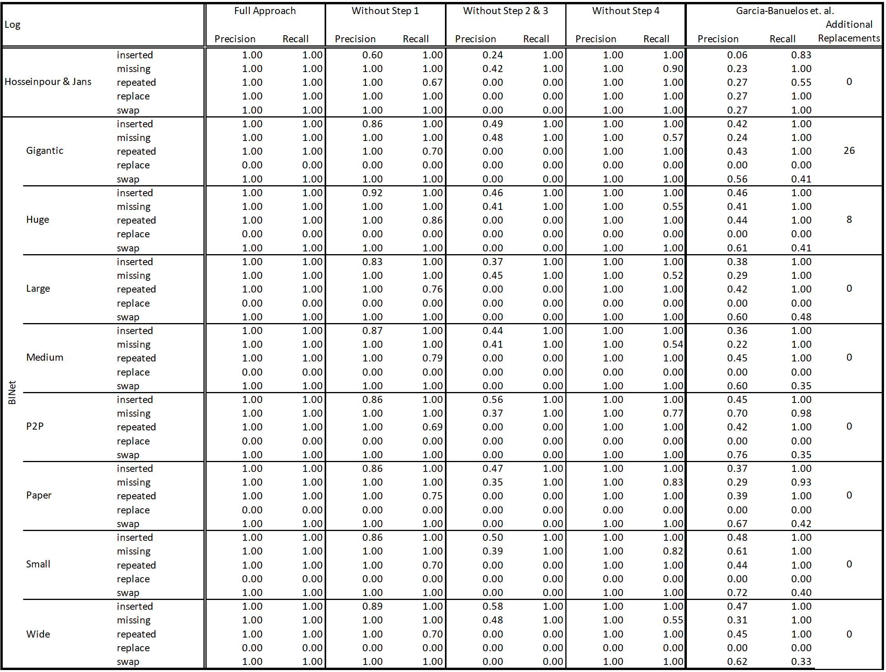

# Usage of this repository
This repository is supposed to help to reproduce the work proposed in the paper "Beyond Log and Model Moves in Conformance Checking: Discovering Process-Level Deviation Patterns"

The file "DevPatterns.ipynb" contains all code used to implement and evaluate the proposed approach. The function "discover_patterns" executes the full approach whereas the function "discover_patterns_wo_cf" executes the approach without adjusting the cost function.

The folder "Evaluation" contains all evaluation results displayed in the paper. This folder contains all event logs and to-be models. 

# Details on function findEquivSeq
As mentioned in the paper, we give more details on the function findEquivSeq, which checks whether a projection of the inverse moves of a sequence seq<sub>1</sub> can be detected in a candidate sequence seq'<sub>3</sub>. If so, it returns this projection seq<sub>3</sub> and an empty sequence otherwise. The functions' logic is illustrated below. 

```
FUNCTION findEquivSeq(seq1,seq'3,M^A):
    seq3=⟨⟩
    FOR move IN seq1:
        IF inverse(move) IN seq'3:
            seq3 ← inverse(move)
            seq1.delete(move)
        ELIF activity(move) IN exclusive_relation(M^A):
            exclusives=get_exclusives(activity(move),M^A)
            IF len(moves_on_exclusives(exclusives, seq'3)) >0:
                seq3 ← moves_on_exclusives(exclusives, seq'3)
                seq1.delete(move)
        ENDIF;
    IF len(seq1)>0:
        move_combinations=get_all_combinations(seq1)
        FOR combination IN move_combinations:
            IF activity(combination) IN exclusive_relation(M^A):
                exclusives=get_exclusives(activity(combination),M^A)
                IF len(moves_on_exclusives(exclusives, seq'3)) >0:
                    seq3 ← moves_on_exclusives(exclusives, seq'3)
                    seq1.delete(combination)
            ENDIF;
    ENDIF;
    IF len(seq1)=0:
        RETURN seq3
    ELSE:
        RETURN ⟨⟩
    ENDIF;

END.
```

The function first initializes seq<sub>3</sub>. Then, it iterates over all moves in seq<sub>1</sub> and checks whether there is the inverse of each move in seq'<sub>3</sub>. If so, a direct projection of the inverse of the move is found in seq'<sub>3</sub>, which is then added to seq<sub>3</sub> whereas the move itself is deleted from seq<sub>1</sub>. 
As mentioned in the paper, the moves in seq'<sub>3</sub> do not have to equal the inverse of seq<sub>1</sub> but can also be behaviorally equivalent to them. Therefore, if no direct projection of a move is found, we check whether there is an indirect projection of the inverse move in seq'<sub>3</sub>. This indirect projection exists if, given M^A, there are moves on activities in an exclusive relationship to the activity of the move under consideration in seq'<sub>3</sub> such that they are behavioral equivalent. If this is the case, the behavioral equivalent moves are added to seq<sub>3</sub> whereas the move itself is deleted from seq<sub>1</sub>. 
Last, it can be the case that combinations of moves in seq<sub>1</sub> are behaviorally equivalent to (a combination of) moves in seq'<sub>3</sub>. Thus, we check whether any combination of moves in seq<sub>1</sub> is behaviorally equivalent to moves on activities in an exclusive relationship to the activity of the move combination under consideration in seq'<sub>3</sub>. If so, we found an indirect projection of the move combination, which is deleted from seq<sub>1</sub> whereas the indrect projection is added to seq<sub>3</sub>.
If all moves are deleted from seq<sub>1</sub> in these iterations, a direct or indirect projection of all moves in seq<sub>1</sub> exists in seq'<sub>3</sub>. In that case, we have found a behaviorally equivalent sequnce seq<sub>3</sub>, which is returned. Otherwise, we return the empyt set.


# Detailed information about the evaluation results

As mentioned in the paper, the evaluation results of the 8 BINet logs are aggregated as averages. Here, you can find detailed information on per event log:


# Time needed for deviation pattern discovery 

To illustrate the time needed for the discovery of deviation patterns in different processes, we show the time needed for data sets used in the paper.

| Log              |                            | Time in seconds |
|------------------|----------------------------|-----------------|
| Hosseinpour & Jans |                          | 11.80         |
| BINet            | Gigantic                   | 29.54           |
|                  | Huge                       | 34.30           |
|                  | Large                      | 47.30           |
|                  | Medium                     | 26.94           |
|                  | P2P                        | 21.64           |
|                  | Paper                      | 22.55           |
|                  | Small                      | 25.24           |
|                  | Wide                       | 20.22           |
| BPIC 12          | A_                         | 2.87            |
